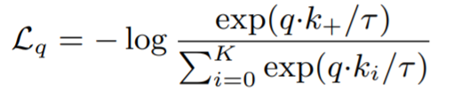
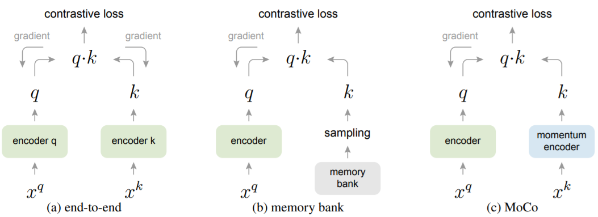
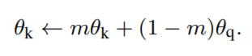

# Representation Learning Papers
May include papers on representation learning, unsupervised learning on images or videos, metric learning and other interesting topics.

## Image Representation Learning
- **Instance Recognition** Unsupervised Feature Learning via Non-Parametric Instance Discrimination, CVPR 2018 [[pdf]](http://openaccess.thecvf.com/content_cvpr_2018/CameraReady/0801.pdf)
  - 
  - **Training**: an instance-level classification task, where the "label" can be regarded as the feature vector for each image/instance in the memory bank. 
  - Non-parametric Softmax
    - 
    - Generalizable to new classes/instances, Computationally efficient by eliminating weights
  - Noise-Contrastive Estimation (I don't fully understand it for now)
  - **Testing**: weighted kNN or SVM trained on learned feature vectors
  - Experiments
    - On CIFAR10, the non-parametric softmax performs ~15% better than parametric softmax; NCE is an efficient approximation.
    - Image classification on ImageNet
    - Scene classification on Places, using the feature extraction networks trained on ImageNet without finetuning
    - Semi-supervised learning
    - Object detection

- **MoCo** Momentum Contrast for Unsupervised Visual Representation Learning [[pdf]]( https://arxiv.org/pdf/1911.05722.pdf )

  - *Contrastive Learning* = To train an encoder for a *dictionary look-up* task/to build a discrete dictionary on high-dimensional continuous inputs such as images; *Contrastive Loss* = A function whose value is low when an encoded query $q$ is similar to its positive key $k_+$ and dissimilar to all other negative keys.
  - *InfoNCE* and the *instance discrimination task* is used in this paper :  
    

  - Previous mechanisms of constrastive losses  
    
    - *End-to-end*  update uses samples in the current mini-batch as the dictionary -> the dictionary size is coupled with the mini-batch size
    - *Memory bank* can support a large dictionary size, but it keeps keys encoded at multiple different steps which are less consistent
  - Momentum Contrast
    - Dictionary as a queue (current mini-batch is enqueued and the oldest mini-batch is dequeued) -> the dictionary size is decoupled from the mini-batch size, so that a large dictionary is possible
    - Momentum update (only the parameters of query encoder are updated by back-propagation) -> the key encoder evolves smoothly, so the keys in the queues are encoded by relatively similar encoders 
      

Dimensional Reduction by Learning an Invariant Mapping (Yann LeCun CVPR'06 )  http://yann.lecun.com/exdb/publis/pdf/hadsell-chopra-lecun-06.pdf 

Deep Learning vs. Traditional Computer Vision https://arxiv.org/ftp/arxiv/papers/1910/1910.13796.pdf 

DeepInfoMax - Learning deep representations by mutual information estimation and maximization (Yoshua Bengio)   https://arxiv.org/pdf/1808.06670.pdf 

CMC (Contrastive Multiview Coding)  http://people.csail.mit.edu/yonglong/yonglong/cmc_icml_workshop.pdf 

CPC (Contrastive Predictive Coding)  https://arxiv.org/pdf/1807.03748.pdf

Unsupervised Embedding Learning via Invariant and Spreading Instance Feature  https://arxiv.org/pdf/1904.03436.pdf 

Learning Representations by Maximizing Mutual Information Across Views  https://arxiv.org/pdf/1906.00910.pdf 

Data-Efficient Image Recognition with Contrastive Predictive Coding  https://arxiv.org/pdf/1905.09272.pdf 

InfoNCE - Representation learning with contrastive predictive coding. arXiv:1807.03748, 2018 
