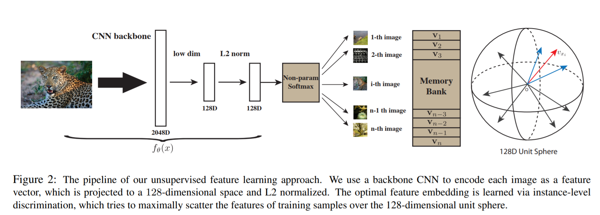
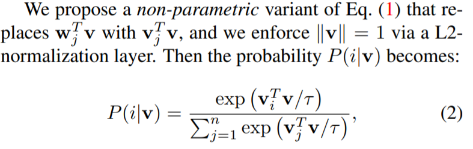

# Representation Learning Papers
May include papers on representation learning, unsupervised learning on images or videos, metric learning and other interesting topics.

## Image Representation Learning
- **Instance Recognition** Unsupervised Feature Learning via Non-Parametric Instance Discrimination, CVPR 2018 [[pdf]](http://openaccess.thecvf.com/content_cvpr_2018/CameraReady/0801.pdf)
  - 
  - **Training**: an instance-level classification task, where the "label" can be regarded as the feature vector for each image/instance in the memory bank. 
  - Non-parametric Softmax
    - 
    - Generalizable to new classes/instances, Computationally efficient by eliminating weights
  - Noise-Contrastive Estimation (I don't fully understand it for now)
  - **Testing**: weighted kNN or SVM trained on learned feature vectors
  - Experiments
    - On CIFAR10, the non-parametric softmax performs ~15% better than parametric softmax; NCE is an efficient approximation.
    - Image classification on ImageNet
    - Scene classification on Places, using the feature extraction networks trained on ImageNet without finetuning
    - Semi-supervised learning
    - Object detection
